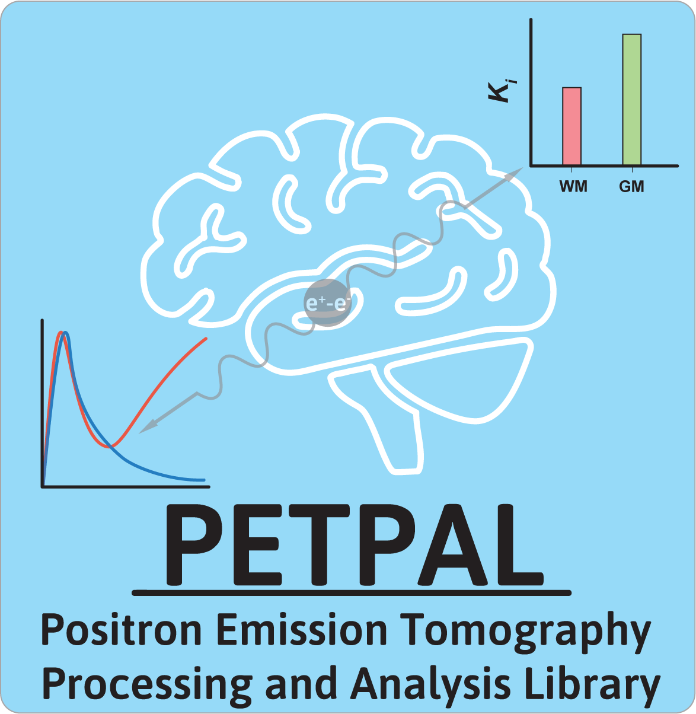

# Positron Emission Tomography Processing and Analysis Library (PETPAL)

<figure>

<figcaption>A comprehensive 4D-PET/MR analysis software suite.</figcaption>
</figure>

## Installation

### Prerequisites

- Python >= 3.12
- [uv](https://docs.astral.sh/uv/) (recommended) or pip

### Quick Start with uv (Recommended)

[uv](https://docs.astral.sh/uv/) is a fast Python package manager that handles virtual environments automatically.

**Install uv:**

```shell
# macOS/Linux
curl -LsSf https://astral.sh/uv/install.sh | sh

# Windows
powershell -ExecutionPolicy ByPass -c "irm https://astral.sh/uv/install.ps1 | iex"

# Or with pipx/pip
pipx install uv
```

**Install PETPAL:**

```shell
# Install from PyPI
uv pip install petpal

# Or install from source (development mode)
git clone https://github.com/PETPAL-WUSM/PETPAL.git
cd PETPAL
uv sync --all-extras
```

### Setting Up a Development Environment

For contributors and developers:

```shell
# Clone the repository
git clone https://github.com/PETPAL-WUSM/PETPAL.git
cd PETPAL

# Create virtual environment and install all dependencies (including dev tools)
uv sync --all-extras

# Activate the virtual environment (optional - uv run handles this automatically)
source .venv/bin/activate  # Linux/macOS
# .venv\Scripts\activate   # Windows

# Run tests
uv run pytest

# Run linting
uv run flake8 . --count --select=E9,F63,F7,F82 --show-source --statistics

# Build documentation
cd docs && uv run make html
```

### Using pip

If you prefer pip over uv:

```shell
# Create and activate a virtual environment
python -m venv .venv
source .venv/bin/activate  # Linux/macOS
# .venv\Scripts\activate   # Windows

# Install from PyPI
pip install petpal

# Or install from source
pip install .

# For development (editable install with all extras)
pip install -e ".[dev]"
```

## Documentation

The official docs are hosted on [Read the Docs](https://petpal.readthedocs.io/en/latest/), which contain helpful tutorials to get started with using PETPAL, and the API reference.

### Building Documentation Locally

```shell
cd docs
uv run make clean
uv run make html
```

Then open `docs/build/html/index.html` in your browser.

## Running Tests

```shell
# Run all tests
uv run pytest

# Run with coverage
uv run pytest --cov=petpal

# Run a specific test file
uv run pytest tests/test_graphical_analysis.py
```

## CLI Commands

PETPAL provides several command-line tools:

| Command | Description |
|---------|-------------|
| `petpal-preproc` | Preprocessing pipeline |
| `petpal-graph-analysis` | Graphical analysis (Patlak, Logan) |
| `petpal-parametric-image` | Generate parametric images |
| `petpal-tcm-fit` | Tissue compartment model fitting |
| `petpal-rtms` | Reference tissue models |
| `petpal-plot-tacs` | Plot time-activity curves |
| `petpal-pet-stats` | PET statistics |
| `petpal-pvc` | Partial volume correction |

Run any command with `--help` for usage details:

```shell
uv run petpal-preproc --help
```

## License

GNU General Public License v3 or later (GPLv3+)
